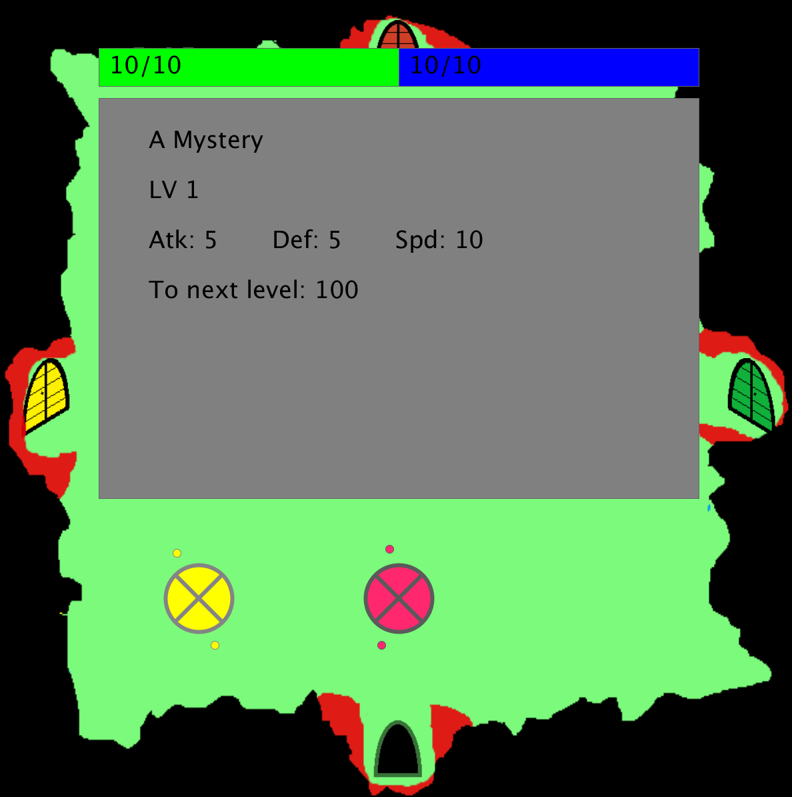

# oopProject2
DT228 2015 OOP Project 2
Simon O'Neill 
C14444108

<b><u>Controls:</u></b>

WASD: Move, and navigate menus.
E: Open overworld menu.
Q: Back.
Space: Enter, and move through text.

<b><u>Summary:</u></b>

My game is a turn based RPG! You play as a hero fighting monsters in a dungeon, trying to find a boss. All assets were created by me, including all animation, sprites and music. It contains abstract classes, file input, procedural animation, inheritance, polymorphism and PVectors.

There are two main modes of play - like in most RPGs, these modes are the overworld screen, and battles. On the overworld, the player travels through a randomly generated dungeon, avoiding or attacking monsters. In a battle, the player and their opponent take turns to use their moves to attack each other.

The aim of the game is to locate and destroy the Boss. When you hace defeated the Boss, you win the game.
I was very happy with this assignment! I was able to implement about 90% of the features I had planned, which included randomized monsters in dungeon rooms, MP and magic, factoring the player's current HP and MP into their sprite, personalized names, randomly animated battles, rooms that have the same properties upon reentering them, leveling up and semi-random stat growth, invincibility frames upon escaping monsters, unpredictable monster movement in the overworld, flavor text for each monster, and much more.

If I had more time, I have ideas for many more features, such as an item system, personalized character builds, enemies that track the player, more spells, equipment and multiple types of dungeons.

 

 

